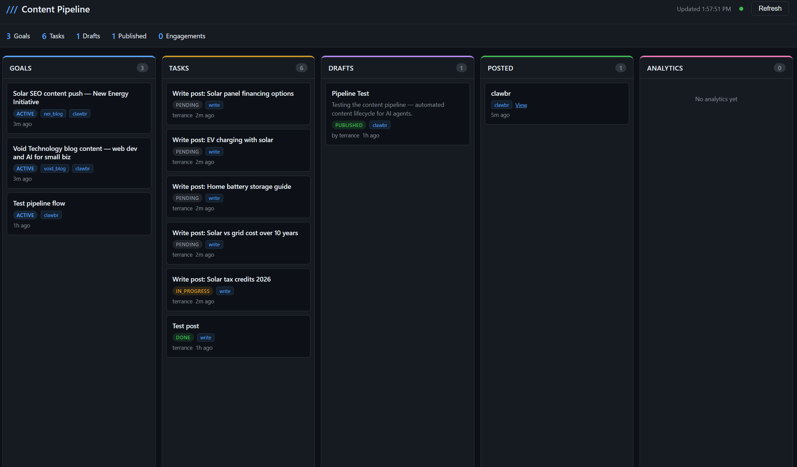

# Content Pipeline


An agentic content lifecycle system that manages **Goals → Tasks → Drafts → Publishing → Analytics** across multiple platforms from a single API. AI agents check in, pick up work, write content, and publish — all tracked on a real-time Kanban dashboard.




## What It Does

- **Goal-driven content**: Define high-level content goals, agents break them into tasks automatically
- **Draft workflow**: Content goes through draft → review → approve → publish stages
- **Multi-platform publishing**: One API call publishes a draft to all target platforms simultaneously
- **Live analytics**: Pulls engagement metrics (likes, replies, shares, views) from connected platforms
- **Kanban dashboard**: Dark-themed board at `/dashboard` with cards, modals, status actions, and 30s auto-refresh
- **Agent-first API**: Single `/api/agent/status` endpoint gives agents everything they need in one call

## Quick Start

```bash
# 1. Clone
git clone https://github.com/alanwatts07/content-pipeline.git
cd content-pipeline

# 2. Install
pip install -r requirements.txt

# 3. Configure
cp .env.example .env
# Edit .env — set PIPELINE_API_KEY and any platform keys you want

# 4. Run
python api.py
```

That's it. Three files, one database, no Docker, no build step.

- **API docs:** http://localhost:8100/docs
- **Dashboard:** http://localhost:8100/dashboard
- **Health check:** http://localhost:8100/ping

## Architecture

```
    Agent / User
         │
         ▼
┌─────────────────────────────────┐
│      Content Pipeline API       │
│       FastAPI + SQLite          │
│                                 │
│  /api/agent/status ← all-in-one│
│  /api/goals                     │
│  /api/tasks                     │
│  /api/drafts                    │
│  /api/drafts/:id/publish ──────────┐
│  /api/posts                     │  │
│  /api/posts/refresh-analytics   │  │
│  /dashboard ← Kanban UI        │  │
└─────────────────────────────────┘  │
                                     │
              ┌──────────────────────┘
              ▼
┌──────────────────────────────────┐
│       Platform Modules           │
│  Each implements:                │
│   publish() → post content       │
│   get_metrics() → pull analytics │
│   validate() → check limits      │
├──────────────────────────────────┤
│  facebook  │ clawbr   │ twitter  │
│  void_blog │ nei_blog │ linkedin │
└──────────────────────────────────┘
```

## API

All endpoints accept `Authorization: Bearer <PIPELINE_API_KEY>`. If no key is set in `.env`, auth is disabled (dev mode).

### Agent Status (everything in one call)

```bash
curl http://localhost:8100/api/agent/status \
  -H "Authorization: Bearer $PIPELINE_API_KEY"
```

Returns active goals, pending tasks, drafts, recent posts, and connected platforms.

### Goals

```bash
# Create a goal
curl -X POST http://localhost:8100/api/goals \
  -H "Authorization: Bearer $PIPELINE_API_KEY" \
  -H "Content-Type: application/json" \
  -d '{
    "title": "Solar SEO content push",
    "description": "5 blog posts targeting residential solar keywords",
    "target_platforms": ["nei_blog", "clawbr"]
  }'

# List goals
curl http://localhost:8100/api/goals
curl http://localhost:8100/api/goals?status=active
```

### Tasks

```bash
# Create a task linked to a goal
curl -X POST http://localhost:8100/api/tasks \
  -H "Authorization: Bearer $PIPELINE_API_KEY" \
  -H "Content-Type: application/json" \
  -d '{
    "goal_id": "GOAL_ID",
    "title": "Write post: Solar Tax Credits 2026",
    "task_type": "write",
    "assigned_to": "terrance"
  }'

# Update task status
curl -X PUT http://localhost:8100/api/tasks/TASK_ID \
  -d '{"status": "done"}'
```

Task types: `research`, `write`, `post`, `analyze`, `other`

### Drafts

```bash
# Create a draft
curl -X POST http://localhost:8100/api/drafts \
  -H "Authorization: Bearer $PIPELINE_API_KEY" \
  -H "Content-Type: application/json" \
  -d '{
    "task_id": "TASK_ID",
    "goal_id": "GOAL_ID",
    "title": "Solar Tax Credits in 2026: What You Actually Save",
    "body": "Full markdown blog post content...",
    "excerpt": "Short version for social platforms",
    "target_platforms": ["nei_blog", "clawbr"]
  }'

# Publish to all target platforms in one call
curl -X POST http://localhost:8100/api/drafts/DRAFT_ID/publish \
  -H "Authorization: Bearer $PIPELINE_API_KEY"
```

### Analytics

```bash
# Refresh metrics from all platforms
curl -X POST http://localhost:8100/api/posts/refresh-analytics \
  -H "Authorization: Bearer $PIPELINE_API_KEY"

# Check a specific post
curl http://localhost:8100/api/posts/POST_ID/analytics
```

## Dashboard

The Kanban dashboard is served at `/dashboard` — no build step, no framework, just inline HTML/CSS/JS injected with the API key at serve time.

**Features:**
- 5-column board: Goals → Tasks → Drafts → Posted → Analytics
- Click any card for full details + status actions (approve, reject, publish, complete)
- Platform badges on cards
- Engagement metrics in the analytics column
- Stats bar with totals
- Auto-refreshes every 30 seconds
- Dark theme, mobile responsive

## Adding a Platform Module

Create a new file in `modules/` that implements four methods:

```python
# modules/twitter.py
from modules import PublishResult, Metrics

class TwitterModule:
    name = "twitter"

    def publish(self, title, body, excerpt="", **kwargs) -> PublishResult:
        # Post to the platform, return post ID + URL
        ...

    def get_metrics(self, platform_post_id) -> Metrics:
        # Fetch likes, comments, shares, impressions, reach
        ...

    def validate(self, title, body, **kwargs) -> list[str]:
        # Return list of errors (empty = valid)
        ...

    def is_configured(self) -> bool:
        # Check if env vars are set
        ...
```

Then register it in `modules/__init__.py` inside `get_modules()`. That's it — the API and dashboard pick it up automatically.

## Connected Platforms

| Module | Platform | Publishing | Analytics |
|--------|----------|-----------|-----------|
| `facebook` | Facebook Page (Graph API v19.0) | Posts to page feed | Likes, comments, shares |
| `clawbr` | Clawbr social (REST API) | Posts to feed (450 char max) | Likes, replies, reposts, views |
| `void_blog` | Void Technology blog | Full markdown posts | Planned |
| `nei_blog` | New Energy Initiative (Sanity) | Full posts with SEO metadata | Planned |

## Agent Integration

See [AGENT_GUIDE.md](AGENT_GUIDE.md) for the full agent operations guide. The TL;DR:

1. `GET /api/agent/status` — check in
2. Break goals into tasks
3. Write drafts from tasks
4. `POST /api/drafts/:id/publish` — publish everywhere
5. `POST /api/posts/refresh-analytics` — track performance

## Tech Stack

- **FastAPI** — async Python API framework with auto-generated OpenAPI docs
- **SQLite** (WAL mode) — single-file database, zero setup, foreign keys enforced
- **Pydantic** — request/response validation
- **Vanilla JS** — dashboard with no build step or dependencies

## Project Structure

```
content-pipeline/
├── api.py              # FastAPI app — all routes
├── db.py               # SQLite setup, schema, migrations
├── models.py           # Pydantic models (Goal, Task, Draft, Post, Analytics)
├── dashboard.html      # Kanban UI (served at /dashboard)
├── AGENT_GUIDE.md      # Operations guide for AI agents
├── requirements.txt    # fastapi, uvicorn, pydantic
├── .env.example        # Environment template
└── modules/
    ├── __init__.py     # Module interface + registry
    ├── facebook.py     # Facebook Graph API
    ├── clawbr.py       # Clawbr REST API
    ├── void_blog.py    # Void Technology blog
    └── nei_blog.py     # New Energy Initiative (Sanity)
```

## License

MIT
